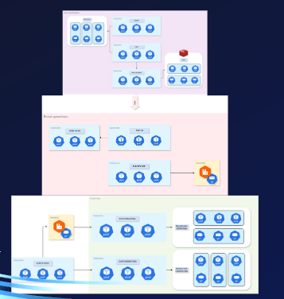

# SkyNet Innovators

Team Member:

- Student 1: [Name], [ID].
- Student 2
- Student 3: LIU YIQI, t0933248
- Student 4:

## 1. Project Overview

### 1.1 Project Description

Roughly describe your project background. 

### 1.2 System Architecture

Provide a high-level overview of the system architecture. Describe the major components and how they interact with each other.

```

```

### 1.3 Key Components
- **Component 1**: Brief description of the component's functionality.
- **Component 2**: Brief description of the component's functionality.
- **Component 3**: Brief description of the component's functionality.

## 2. Environment Setup

### 2.1 Prerequisites
List all the prerequisites needed to set up the environment.
- Istio
- Kubernetes Gateway API CRDs
- go version 1.21
- OperatorSDK

Please see 2.2 for more information.

### 2.2 Installation
Step-by-step guide to setting up the development environment.
Linux Ubuntu
we assume you have
git
docker
AWS CLI 
Kubectl
AWS Configured
ESK Cluster Setup
1. **Step 1**: Istio.
    ```bash
    curl -L https://istio.io/downloadIstio | sh -
    cd istio-1.22.3
    export PATH=$PWD/bin:$PATH
    istioctl install --set profile=demo -y
    ```
2. **Step 2**: Kubernetes Gateway API CRDs.
   
    ```bash
    kubectl kustomize "github.com/kubernetes-sigs/gateway-api/config/crd?ref=v1.1.0" | kubectl apply -f -
    ```
3. **Step 3**: go version 1.21.
   
    ```bash
    wget https://go.dev/dl/go1.21.12.linux-amd64.tar.gz
    sudo tar -C /usr/local -xzf go1.21.12.linux-amd64.tar.gz
    export PATH=$PATH:/usr/local/go/bin
    source ~/.profile
    go version
    ```

4. **Step 4**: OperatorSDK.
   
    ```bash
    git clone https://github.com/operator-framework/operator-sdk
    cd operator-sdk
    git checkout master
    make install
    ```
## 3. Application Deployment

Detailed steps to deploy the application.

1. **Step 1**: Apply all the yaml files
    
    ```bash
    kubectl apply -f "$dir"
    ```
2. **Step 2**: Deploy the operator.
    ```bash
    make deploy
    ```
3. Or you can quickly start the project
    ```bash
    ./start.sh
    ```

